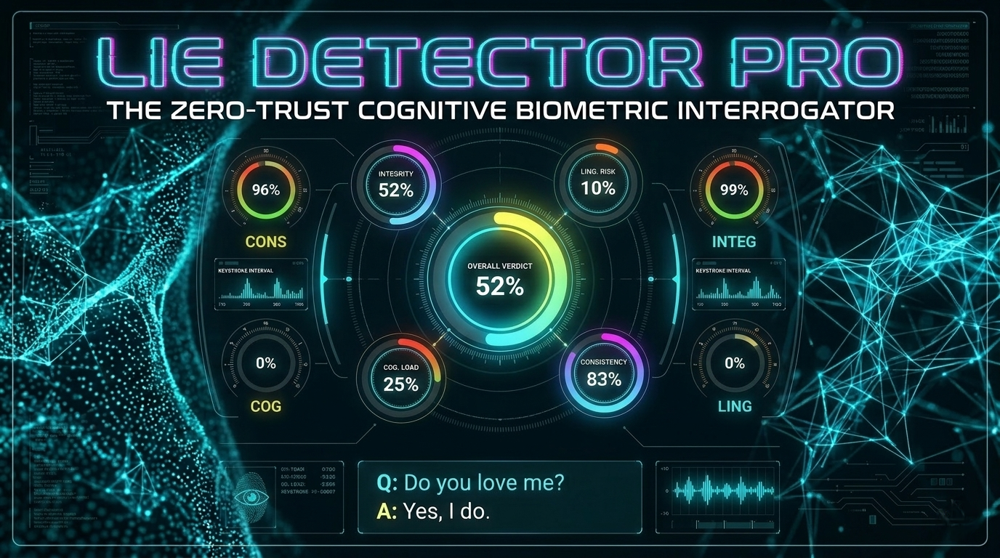

<h1 align="center">🧠 LIE DETECTOR PRO</h1>
<p align="center">
<em><strong>The Zero-Trust Cognitive Biometric Interrogator</strong></em>
</p>

<p align="center">

</p>

<p align="center">
  <a href="https://lie-detector-pro.vercel.app">
    
  </a>
  <a href="https://github.com/MrV3nomous/lie-detector-pro">
    
  </a>
</p>

<p align="center">
                            
</p>


---


## 💡 The Idea

Most apps ask for an answer. This one studies how you answer. 🧑🏻‍🔬

It watches the pauses, the rhythm, the hesitation, and the story hidden between the lines.

Lie Detector Pro turns a simple conversation into a behavioral signal stream, fusing database-level deterministic scoring with AI semantic analysis to produce a sharper, multi-layered verdict.

<br/>

  
**Try it yourself:**

<a href="https://lie-detector-pro.vercel.app">
    
  </a>


<br/>
<br/>


---


## ⚙️ System Architecture & Data Flow


```
[User Input] ➔ (React/Vite UI) ➔ [Supabase PostgreSQL]
                                       ↓ (PL/pgSQL Triggers)
                                 [Edge Function] ➔ (Google Gemini AI)
                                       ↓
[Final Verdict UI] ⬅ (Data Fusion) ⬅ [Stateful DB Update]
```


This is not a simple form submission.
It is a secure, single-submission session flow.
The database computes the raw telemetry,
Gemini performs a semantic review, and the UI merges both into an immediate, cinematic verdict.


---


## 👬 The Two Brains


**👨🏻‍💻💠 1) Titanium Verdict Engine (PostgreSQL)**

The deterministic layer. It is fast, strict, and built on a zero-trust architecture that never relies on the client browser.
It evaluates:
- Cognitive load & typing speed
- Linguistic risk & hesitation gaps
- Answer consistency
- Refresh & tamper behavior

  
**🌐 2) Gemini AI Analysis Layer (Edge Function)**

The interpretive layer. It reads the full transcript payload to detect complex psychological signals, returning:
- A deception base penalty
- A mathematical confidence score
- A behavioral profile & question-level flags
- Cross-answer contradiction awareness

  
**🤝 3) The Fusion Layer**

SQL provides the baseline truth.
AI refines the interpretation.
The UI presents the combined story.


---


## 🦾 Heavy-Lifting Survival (Chaos Engineering)

This app was not just built to run; it was built to survive.
The backend is hardened by a **Stateful Distributed Systems Test Suite** (built in Deno) to guarantee database atomicity and strict bounds.

It successfully defends against:
- **Prompt Injection & DOM Corruption:** Zalgo text, Base64 poisoning, and logical paradox loops.
- **Stateful Race Conditions:** Mitigated via Optimistic Concurrency Control to prevent split-brain DB states.
- **Stale AI Overrides:**;Async timing protections to ensure delayed LLM responses don't corrupt fresh user data.
- **Numeric Precision Drift:** Math clamping to prevent floating-point anomalies and double-penalty cascading.
- **Psychological Warfare:** Detects over-persuasion, emotional guilt trips, and "perfect liar" scripted responses.


---


## ✨ Visual Language

The app uses a high-impact interrogation aesthetic:
- Neon HUD styling and particle canvas motion
- Orbital radial metrics and animated result dials
- Answer-level visual breakdowns

It looks like a control room because it is meant to feel like one.


---


## 🚀 Setup & Installation

To run this project locally, you need Node.js and the Supabase CLI installed.

**1. Clone the repository**

```bash git clone https://github.com/MrV3nomous/lie-detector-pro.git
cd lie-detector-pro
```

**2. Start the Backend (Supabase)**

Ensure Docker is running on your machine, then initialize the database and edge functions:

```bash
supabase start
supabase functions deploy analyze-interrogation
```

**3. Start the Frontend**

Open a new terminal window and set up the React client:

```bash
cd client npm install
```


**4. Create a .env file in the /client directory with your local (or remote) Supabase credentials:**

```bash
VITE_SUPABASE_URL=http://127.0.0.1:54321
VITE_SUPABASE_ANON_KEY=your_local_anon_key
```

**5. Run the application with:**

```bash
npm run dev
```

---


## 📜 The Philosophy

Truth is not just what is said.
Truth is also how it is said, when it is said, and what changes when the same person is asked twice.
Lie Detector Pro exists in that space.
Built to be shared, explored, and tested.


**Try it. Break it. See what it says back.**


---

<p align="center">
🪪 MIT LICENSE ©️ | SOUMIK HALDER 2026 </p>


---
